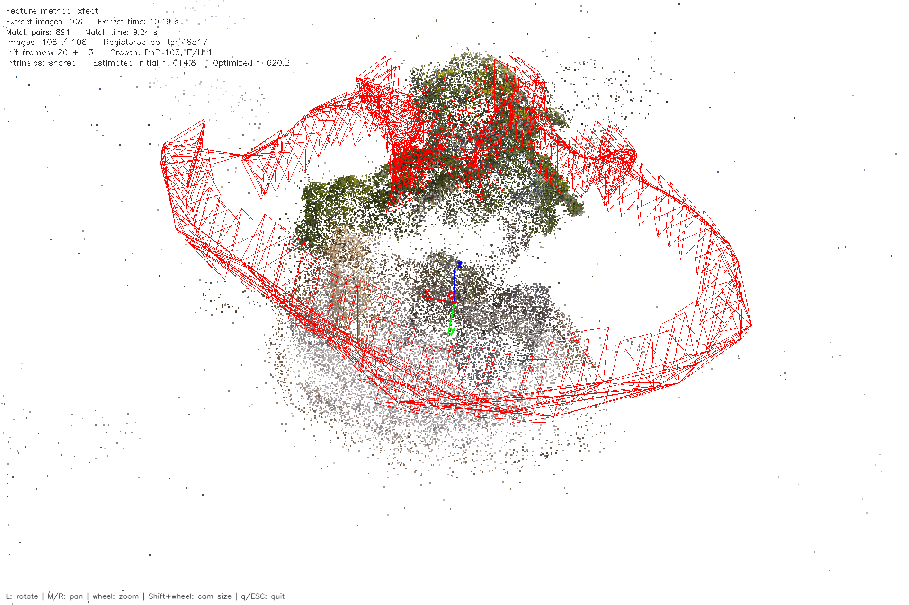

# Structure from Motion (SfM)

## System Overview

This project is an SfM (Structure from Motion) system that utilizes computer vision and image processing technologies to 
reconstruct three-dimensional structures from multiple photographs. Aiming to provide developers with a complete, basic SfM solution.


## Demonstration

Real-time reconstruction result (108 image sequence, XFeat backend):




## Development Environment

- **Operating System**: Windows 10 or higher, Linux
- **Development Environment**: Visual Studio 2017 or higher (Windows), GCC/G++ (Linux)
- **Main Dependencies**:
  - **Ceres Solver**: Used for Bundle Adjustment (BA) optimization
  - **OpenCV 4.4.0 or higher**: 
      Used for image processing and computer vision operations, especially as newer versions include the SIFT algorithm in the main module, 
	  eliminating the need for the extra contrib module.
  - **Eigen**: Provides efficient matrix and vector calculations.

## Installation Guide

### Windows Installation

It is recommended to use [vcpkg](https://github.com/microsoft/vcpkg) to manage and install project dependencies to simplify the configuration process.

- **Install vcpkg** (if not already installed):
   ```bash
   git clone https://github.com/Microsoft/vcpkg.git
   cd vcpkg
   ./bootstrap-vcpkg.bat
   ./vcpkg integrate install
   ```

- **Install Ceres Solver via vcpkg**:
  ```bash
  vcpkg install ceres:x64-windows
  ```

- **OpenCV**:
  We recommend downloading the precompiled binaries of OpenCV directly from (https://opencv.org/releases/).
  This approach simplifies the installation process, especially for users who may not be familiar with building from source.
  
### Linux Installation
- **Install Denpendencies**:
  ```bash
  sudo apt-get update
  sudo apt-get install -y git cmake build-essential libopencv-dev libeigen3-dev
  ```
	
- **Install Ceres Solver:**:
  ```bash
  sudo apt-get install -y libgoogle-glog-dev libgflags-dev libatlas-base-dev libsuitesparse-dev
  git clone https://ceres-solver.googlesource.com/ceres-solver
  mkdir ceres-bin
  cd ceres-bin
  cmake ../ceres-solver
  make -j4
  sudo make install
  ```
	
- **Install OpenCV 4.4.0 or higher**:
  ```bash
  sudo apt-get install -y libopencv-dev
  sudo apt-get remove -y libopencv-dev
  sudo apt-get install -y build-essential cmake git libgtk2.0-dev pkg-config libavcodec-dev libavformat-dev libswscale-dev
  sudo apt-get install -y python3.8-dev python3-numpy libtbb2 libtbb-dev libjpeg-dev libpng-dev libtiff-dev libdc1394-22-dev

  git clone https://github.com/opencv/opencv.git
  cd opencv
  git checkout 4.4.0
  mkdir build
  cd build
  cmake -D CMAKE_BUILD_TYPE=Release -D CMAKE_INSTALL_PREFIX=/usr/local ..
  make -j4
  sudo make install
  ```
	
## Building the Project

### Windows:
  The project is built using CMake. For ease of configuration, it's recommended to use CMake GUI.
  You can download CMake GUI from (https://cmake.org/download/).

### Linux:
  ```bash
  mkdir build
  cd build
  cmake ..
  make
  ```

## Feature Extraction Methods

The pipeline supports three feature extraction/matching backends, selected via
`feature.method` in `data/Config.yaml`:

- **`sift`** (default): OpenCV SIFT keypoints + binary/float hybrid brute-force
  matching. Behavior is identical to the original implementation.
- **`xfeat`**: A self-contained C++ re-implementation of the
  [XFeat](https://www.verlab.dcc.ufmg.br/descriptors/xfeat_cvpr24/) (CVPR 2024)
  convolutional backbone with no external ML runtime (no libtorch / ONNX
  Runtime / OpenCV DNN). Keypoint extraction, softmax heatmap NMS, reliability
  scoring, top-k selection and bicubic descriptor sampling are all implemented
  in C++ to match the PyTorch semantics exactly. Matching uses mutual best-match
  with a cosine-similarity threshold, mirroring the official `XFeat.match()`.
- **`superpoint`**: [SuperPoint](https://arxiv.org/abs/1712.07629) (DeTone et
  al., CVPR 2018) running through **ONNX Runtime**. The network is exported from
  the official PyTorch checkpoint with `tools/export_superpoint_onnx.py`; the
  sparse post-processing (softmax over the 64 cell sub-positions, bilinear
  heatmap upsampling, fast NMS, border removal, descriptor grid sampling)
  mirrors the reference `SuperPointFrontend`. Matching uses mutual best-match
  with a cosine-similarity threshold.

Relevant `feature.*` configuration keys:

| Key | Description |
|-----|-------------|
| `feature_count` | Max SIFT keypoints per image (used only when `method: sift`) |
| `method` | `sift`, `xfeat` or `superpoint` |
| `xfeat_weight` | Path to the binary weight file (`xfeat.bin`) |
| `xfeat_top_k` | Max XFeat keypoints per image (default `2000`) |
| `xfeat_match_threshold` | Min cosine similarity for mutual XFeat matching (default `0.82`) |
| `superpoint_weight` | Path to the ONNX model file (`superpoint.onnx`) |
| `superpoint_top_k` | Max SuperPoint keypoints per image (default `1024`) |
| `superpoint_nms_radius` | Non-maximum suppression radius (default `4`) |
| `superpoint_detection_threshold` | Min detector confidence (default `0.015`) |
| `superpoint_match_threshold` | Min cosine similarity for mutual SuperPoint matching (default `0.9`) |
| `superpoint_max_dim` | Downscale images larger than this before running the network (default `640`) |

### Preparing the XFeat weights

The C++ engine reads a compact binary weight file produced from the official
PyTorch checkpoint by `tools/export_xfeat_weights.py`:

```bash
python3 tools/export_xfeat_weights.py --weights path/to/xfeat.pt --output weights/xfeat.bin
```

Place the generated `weights/xfeat.bin` in the project `weights/` directory (or
point `feature.xfeat_weight` at it). The CMake build copies it next to the
`SFMDemo` executable automatically so the default relative path works.

### Preparing the SuperPoint model

The SuperPoint backend needs the ONNX model exported from the official
PyTorch checkpoint by `tools/export_superpoint_onnx.py`:

```bash
python3 tools/export_superpoint_onnx.py --weights weights/superpoint_v1.pth \
    --output weights/superpoint.onnx
```

The build links against a bundled `libonnxruntime.so` (placed in `lib/`, with
headers in `include/`) and copies both it and `weights/superpoint.onnx` next to
the `SFMDemo` executable.

## Note:
  If the camera is uncalibrated, please set the focal length to -1 in the configuration parameters. The initial focal length will be automatically calculate. 
  If optimization of internal parameters is specified, the focal length and distortion coefficients will also be optimized during the bundle adjustment (BA) process.